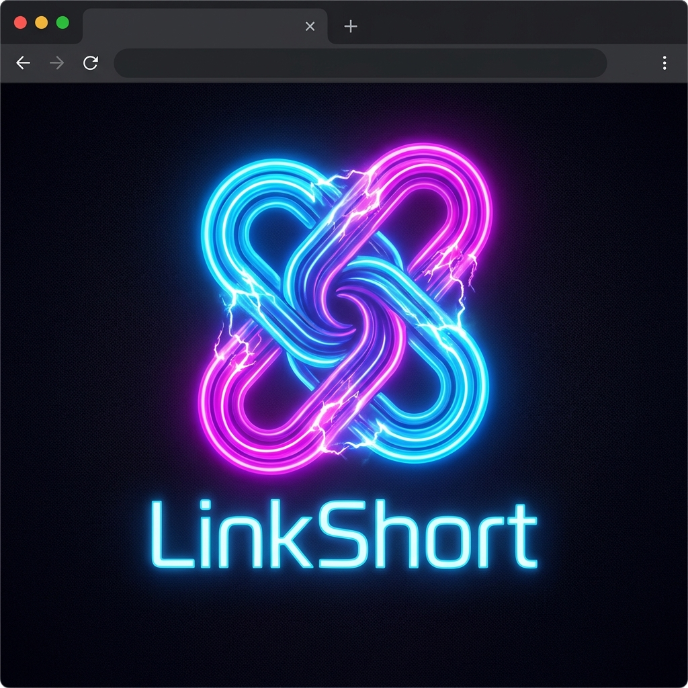

# 🚀 LinkShort - Bulk URL Shortener & QR Code Generator



**LinkShort** is a modern, fast, and secure **Bulk URL Shortener & QR Code Generator** built with Python (Flask) and a premium light-mode UI. It is designed specifically for power users who need to manage dozens of links and generate branded QR codes with custom greetings and emojis.

## ✨ Features
- **⚡️ Fast Shortening**: Instantly convert long URLs into short, shareable links.
- **📦 Bulk Support**: Paste multiple links at once (one per line) and shorten them all in one click.
- **🏷 Custom Aliases**: Choose your own short slugs (e.g., `linkshort.live/my-video`).
- **🎨 Premium UI**: Beautiful dark-mode design with glassmorphism effects and smooth animations.
- **📈 SEO Ready**: Built-in Meta tags, Open Graph support, `robots.txt`, and `sitemap.xml`.
- **💰 Monetization Ready**: Dedicated ad banner spaces integrated into the design.
- **📱 Responsive**: Fully optimized for mobile, tablet, and desktop.

## 🛠 Tech Stack
- **Backend**: Python / Flask
- **Database**: SQLite
- **Frontend**: HTML5, Vanilla CSS, JavaScript
- **Deployment**: Render.com
- **DNS/Domain**: Namecheap

## 🚀 Quick Start (Local Setup)

1. **Clone the repository**:
   ```bash
   git clone https://github.com/linkshortfree/linkshort.git
   cd linkshort
   ```

2. **Install dependencies**:
   ```bash
   pip install -r requirements.txt
   ```

3. **Run the app**:
   ```bash
   python app.py
   ```
   Visit `http://localhost:5001` in your browser.

## 🌍 Deployment
This app is ready for deployment on **Render** or **Railway**.

1. Connect your GitHub repository to Render.
2. **Build Command**: `pip install -r requirements.txt`
3. **Start Command**: `gunicorn app:app`
4. **Environment Variables**: Set `PORT` (optional, defaults to 5001).

## 📄 License
This project is open-source. Feel free to use and modify it!

---
Developed with ❤️ by [LinkShort](https://linkshort.live)
